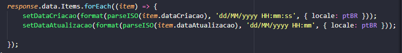

# DATE-FNS #

### O que é o date-fns?
É uma biblioteca de formatação de datas para javascript e nodejs. 

E tudo o que você precisa para usufruir disso, é instalar ela no seu projeto. Então, vamos lá.

Se você utiliza o npm, use o seguinte comando: </br> 
```npm install date-fns --save```

Se você utiliza o yarn, rode: </br>
```yarn add date-fns```

Aguarde finalizar a instalação. 

<p>E para formatar é simples, o date-fns conta com uma documentação muito objetiva e clara, no link abaixo você pode encontrar todas as formatações possíveis. </p>

<a href="https://date-fns.org/v2.21.1/docs/format">Documentação para os tipos de formatação disponíveis no date-fns</a>

### Implementação

Importe os seguintes módulos: </br>
```import { format, parseISO } from 'date-fns';```</br>
```import ptBR from 'date-fns/locale/pt-BR';```

No exemplo a seguir, a formatação foi feita com ReactJS. </br>



</br>

Na primeira formatação temos: </br>
```07/05/2021 20:41:06``` 

E na segunda: </br>
```07/05/2021 20:41```

<a href="https://date-fns.org/">Documentação completa date-fns</a>


